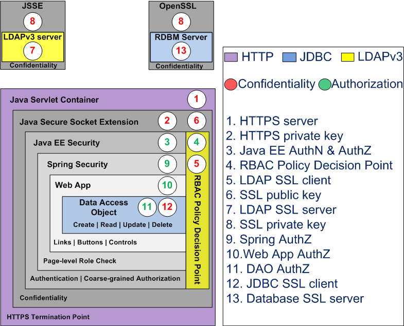

# README for Apache Fortress Demo End-to-End Security Example

## Security Layers in this Demo
 

## Document Overview
 This document is the starting point for the apache fortress demo web app.  It provides directions to download the source package from github, and generate a java document that contains the actual installation instructions.

## Prerequisites for target environment
1. Debian or Redhat Liunx machine with OpenSSL installed.
2. Java 8
3. Apache Maven 3++
4. Apache Tomcat 7++
5. Firefox Web Browser
6. Successful installation of an LDAP server and passed integration test in Apache Fortress Core Quickstart:
    * *SECTION 3. Apache Fortress Core Integration Test* in [README-QUICKSTART-SLAPD.md](https://github.com/apache/directory-fortress-core/blob/master/README-QUICKSTART-SLAPD.md)
    * *SECTION 4. Apache Fortress Core Integration Test* in [README-QUICKSTART-APACHEDS.md](https://github.com/apache/directory-fortress-core/blob/master/README-QUICKSTART-APACHEDS.md)

 These instructions have been modified to use either openldap and apacheds LDAP servers.  Be sure to choose the correct instructions, either [Apache Directory SSL](target/site/apidocs/doc-files/apache-directory-ssl.html) or [OpenLDAP SSL](target/site/apidocs/doc-files/openldap-ssl.html).

## Instructions for downloading and generating the install doc

1. [Download ZIP](https://github.com/shawnmckinney/apache-fortress-demo/archive/master.zip)

2. Extract the contents to your local machine.

3. cd apache-fortress-demo-master

4. Set java and maven home env variables.

5. Generate the java document that contains the demo installation instructions:

 ````maven
 mvn javadoc:javadoc
 ````

 note: if using java 8, add this param to the pom.xml:

 ```xml
 <plugin>
    ...
    <artifactId>maven-javadoc-plugin</artifactId>
    <configuration>
        <additionalparam>-Xdoclint:none</additionalparam>
        ...
    </configuration>
 </plugin>
 ```

6. Perform these steps:
 * [Heartbleed Bug](target/site/apidocs/doc-files/opensslheartbleed.html)
 * [Managing PKI Keys](target/site/apidocs/doc-files/keys.html)
 * [Set Hostname Entry](target/site/apidocs/doc-files/hosts.html)
 * [Apache Directory SSL](target/site/apidocs/doc-files/apache-directory-ssl.html) or [OpenLDAP SSL](target/site/apidocs/doc-files/openldap-ssl.html)
 * [Apache Fortress Core SSL](target/site/apidocs/doc-files/apache-fortress-core-ssl.html)
 * [Install MySQL](target/site/apidocs/doc-files/mysql.html)
 * [Apache Tomcat SSL](target/site/apidocs/doc-files/apache-tomcat-ssl.html)
 * [Apache Fortress Demo](target/site/apidocs/doc-files/apache-fortress-demo.html)

 [links are relative to the target machine: **target/site/apidocs/doc-files/** on local machine]
